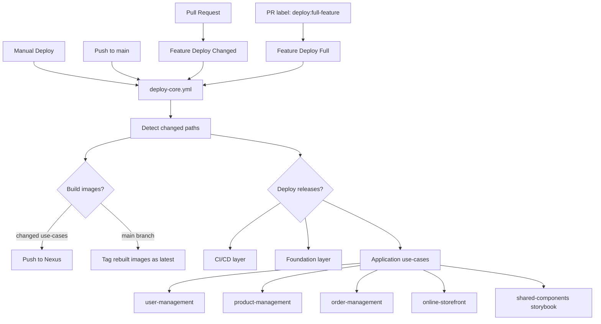

# GitHub Automation

This directory keeps the deployment entrypoints small and pushes the shared logic into `workflows/deploy-core.yml`.

## Deployment Workflows

| Workflow | Trigger | Purpose |
| --- | --- | --- |
| `deploy.yml` | Manual | Deploy `all`, `ci-cd`, `foundation`, or `application`. |
| `deploy-main.yml` | Push to `main` | Build and deploy changed application use-cases; deploy foundation only when it changed. |
| `deploy-feature-changed.yml` | Pull request | Deploy only changed application use-cases into the feature namespace. |
| `deploy-feature-full.yml` | Pull request with `deploy:full-feature` label | Deploy feature foundation plus all application use-cases. |
| `deploy-core.yml` | Reusable workflow | Shared build, image push, Helm deploy, rollout, and smoke-test logic. |

Feature branches must match `feature/<10 lowercase alphanumeric chars>`. The namespace is the suffix after `feature/`.

## Build vs Deploy

`deploy-core.yml` separates two decisions:

- `build_*`: changed use-cases that need new images for the current commit.
- `deploy_*`: use-cases that should be installed or upgraded in Kubernetes.

For full feature deployments, changed use-cases use the current commit image tag. Unchanged use-cases reuse `latest` unless a different fallback tag is supplied.

## Flow

## Use-Cases

- Changed feature deploy: open or update a PR from a valid feature branch.
- Full feature deploy: add the `deploy:full-feature` label to the PR.
- Operational deploy: run `Deploy` from the Actions tab and choose the layer.
