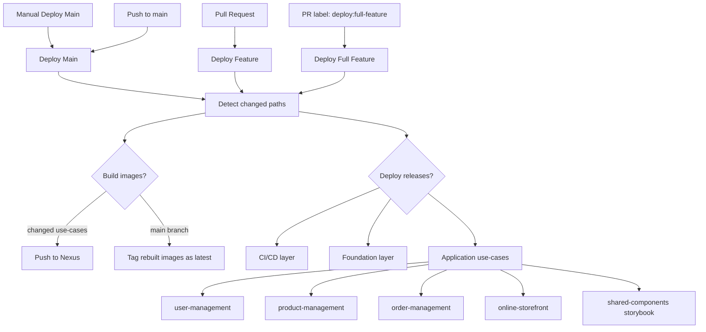

# GitHub Automation

This directory keeps the deployment workflows focused around the three ways the platform is deployed.

## Deployment Workflows

| Workflow | Trigger | Purpose |
| --- | --- | --- |
| `deploy-main.yml` | Manual or push to `main` | Manual deploys can target `all`, `ci-cd`, `foundation`, or `application`; main pushes deploy only changed layers/use-cases. |
| `deploy-feature-changed.yml` | Pull request | Build and deploy changed use-cases into the feature namespace, reusing stable dependencies from `eco-test`. |
| `deploy-feature-full.yml` | Pull request with `deploy:full-feature` label | Deploy feature foundation plus all application use-cases. |

Feature branches must match `feature/<1-10 lowercase alphanumeric chars>`. The namespace is the suffix after `feature/`.

## Build vs Deploy

Each deploy workflow separates two decisions:

- `build_*`: changed use-cases that need new images for the current commit.
- `deploy_*`: use-cases that should be installed or upgraded in Kubernetes.

Changed feature deployments keep the namespace small. For example, order-management deploys into the feature namespace while `order-gateway` calls `user-service` through the stable `eco-test` service DNS.
Set `FEATURE_DEPENDENCY_NAMESPACE` in the environment config to change that stable namespace. Specific URLs can be overridden with `FEATURE_USER_SERVICE_INTERNAL_URL`, `FEATURE_PRODUCT_SERVICE_INTERNAL_URL`, or `FEATURE_PRODUCT_GATEWAY_INTERNAL_URL`.

For full feature deployments, changed use-cases use the current commit image tag. Unchanged use-cases reuse `latest` unless a different fallback tag is supplied.

## Frontend Build Reuse

Frontend application and Storybook outputs are stored in the Nexus raw repository `eco-node-builds`.
The deployment workflows call `.github/workflows/scripts/frontend-build-artifacts.sh` with only the frontend artifacts in scope for the changed use-cases.
The script hashes tracked source files plus the pnpm workspace and lockfile, restores a matching tarball from Nexus when available, and only runs the pnpm build commands when that hash has not been published yet.

## Flow

## Use-Cases

- Changed feature deploy: open or update a PR from a valid feature branch.
- Full feature deploy: add the `deploy:full-feature` label to the PR.
- Operational deploy: run `Deploy Main` from the Actions tab and choose the layer.
